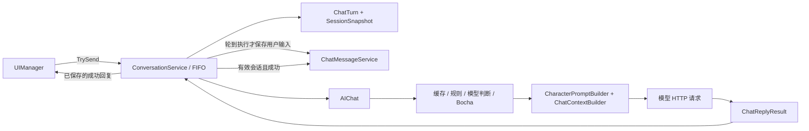

# AIDesktopPetty · AI 桌面陪伴与樱町站台

这是一个 Unity Windows 桌面 AI 陪伴项目。当前可运行入口提供登录、角色管理、聊天、历史记录和基于前台窗口的主动气泡；另有独立的樱町 3D 站台场景。求职作品的后续主线是 **桌宠 → 站台 → 交互 → 返回桌宠**，世界切换闭环尚未接通。

核对日期：2026-10-01；代码基线为 Git `6853f6f`，前一阶段快照/回合制重构为 `8473655`。本次仅更新文档。2026-09-30 的隔离测试、构建是历史验证；2026-10-01 用户确认原数据库已成功迁移并登录，不据此推断所有聊天和窗口用例通过。

## 阅读入口

| 读者/任务 | 建议顺序 |
| --- | --- |
| 了解项目和运行方式 | 本 README → [架构与当前缺口](docs/ARCHITECTURE.md) |
| 找到脚本及其职责 | [逐文件脚本索引](docs/SCRIPTS.md)，覆盖项目自有 C# 脚本及 SQLite 兼容层 |
| 修改聊天、账户数据或窗口 | [M0 不变量与验收状态](docs/M0_ARCHITECTURE_AND_HANDOFF_2026-09-30.md) → [接口与事件](docs/API_EVENTS.md) → 源码 |
| 将原计划拆为实现任务 | 本 README + 原计划 → [实现定位与拆任务指南](docs/IMPLEMENTATION_GUIDE.md) |
| 理解重构原因、准备面试 | [逐脚本重构报告](docs/M0_IMPLEMENTATION_REPORT_2026-09-30.md)；[第一阶段报告](docs/SESSION_REFACTOR_REPORT_2026-09-30.md)是历史记录 |

[近期计划](docs/PROJECT_PLAN.md)和用户提供的原 PDF 本轮不更新。遇到其中的旧接口、旧列车时序或旧验证状态，以当前源码和上述文档核对后的事实为准。AI 协作规则在 [AGENTS.md](AGENTS.md)。

## 已实现内容与边界

| 能力 | 当前实现 | 尚未证明/尚未实现 |
| --- | --- | --- |
| 登录与管理 | 本地密码验证、用户/角色增删改查、权限 UI、角色切换；改名按稳定 UserId 保持角色关联 | 默认管理员和密码策略尚未用于公开发布加固 |
| 普通聊天 | 协程、非流式；SessionSnapshot + ChatTurn；FIFO 队列；成功/失败/取消；当前输入只追加一次 | 无流式输出、自动重试、长期语义记忆；切角色及网络故障还需逐项运行验收 |
| 搜索与 Prompt | SiliconFlow 兼容聊天接口、Bocha 搜索；缓存 → 规则 → 必要时模型判断；角色 Prompt 来自数据库 JSON | 模型权限/可用性依赖本机账号；主动气泡仍用字符串回调 |
| 主动气泡 | 前台标题/进程检测、停留阈值、冷却、过滤、快照与旧结果检查、独立气泡显示 | 不与普通聊天共用队列；前台信息可能进入网络请求、本地事件和 Unity 日志 |
| 本地数据 | SQLite 六张业务表；schema 版本 1；先备份、角色 UserId 回填、孤儿隔离；用户/角色事务级联 | 情绪调用仍以名称填充 ID 参数，属于已发现的归属缺口 |
| Windows 窗口 | IWindowService → WindowsWindowService → Native ABI → x64 DLL；无边框、透明、置顶、拖拽、吸附、穿透和 DPI/显示器查询 | 自检通过不代表全部跨屏/DPI/窗口交互通过 |
| UI 布局 | DesktopPetLayoutController + Profile 统一登录、折叠、聊天、管理布局 | 尚无应用模式/世界状态机；窗口失败时的 UI 回滚需核对 |
| 樱町站台 | 3DScene 引用 180 秒列车/栏杆/六灯循环、Timeline 音频、樱花 VFX、天空旋转、八份 A 版人物材质 | 不在当前构建列表；没有产品级进入/退出/失败恢复 |
| 后续技术 | 当前使用 Unity 协程、内置场景和资源能力 | 未安装 YooAsset、UniTask、Cinemachine、HybridCLR；无自有 asmdef；AI Action、房间、多人是规划 |

## 环境、配置与启动

- 编辑器：**Unity 2021.3.21f1c1**，以 [ProjectVersion.txt](ProjectSettings/ProjectVersion.txt) 为准。
- 渲染：URP / VFX Graph **12.1.10**；Timeline 1.6.4、TMP 3.0.6、Newtonsoft JSON 3.2.2，见 [manifest.json](Packages/manifest.json)。
- 目标：Windows x64。[Build Settings](ProjectSettings/EditorBuildSettings.asset)仅启用 `Assets/Scenes/SampleScene.unity`。

1. 用上述编辑器打开项目并打开 [SampleScene](Assets/Scenes/SampleScene.unity)，保留脚本和序列化绑定。
2. 若本机尚无配置，将 [config.example.json](Assets/StreamingAssets/config.example.json)复制为同目录 config.json，填写自己的密钥。已有配置保留，真实配置不进入 Git。
3. 保留 [DefaultCharacterPrompt.json](Assets/StreamingAssets/DefaultCharacterPrompt.json)。启动时验证文件存在且非空；初次创建默认角色时将 JSON 写入库，修改文件不会自动覆盖已存在角色。
4. 首次启动默认账号为 DefaultUser / 123456，角色 DefaultCharacter，权限 Admin。登录页会预填；使用已有库时输入已有账号和角色。这是开发默认行为，用户决定后续安全阶段加固。
5. Editor 检查 UI/数据；构建 Windows x86_64 Player 检查真正的桌面窗口。Editor 不能替代 Windows Player 原生窗口验证。

| 配置项 | 含义与默认值 |
| --- | --- |
| siliconFlowKey | 普通回复、搜索模型决策和主动气泡的模型密钥；缺失使 AI 请求失败 |
| bochaApiKey | 搜索密钥；缺失时需要搜索的轮次会失败 |
| siliconFlowUrl | 默认 https://api.siliconflow.cn/v1/chat/completions |
| bochaUrl | 默认 https://api.bochaai.com/v1/web-search |
| model | 默认 Pro/deepseek-ai/DeepSeek-V3，可由本地配置覆盖 |
| timeoutSeconds | 单次 HTTP 超时默认 30 秒，有效正值限制到 1–120 秒；一轮可能有多次请求，不是整轮 30 秒 |

缺 config.json 影响 AI 请求；数据库/默认 Prompt 初始化失败才会通过 AppInitializer.StartupError 阻断登录。Windows Player 配置位于输出的 `<程序名>_Data/StreamingAssets`。默认值不证明服务端账号已开通对应模型。

## 核心链路与本次重构

普通聊天沿以下现有脚本执行：

SessionSnapshot 固定请求时的用户/角色 ID、名称、权限和会话版本；ChatTurn 再固定 TurnId、用户消息 ID、输入及创建时间。登录、退出、切角色、当前角色改名或当前用户资料变化推进版本，使旧请求失效。UI 先显示待执行气泡，数据库在轮到该 Turn 时保存输入；模型消息排除这条消息，再追加当前输入一次。

失败/取消不写 Assistant 正常消息、不增加回复成功关系值。已保存用户消息留在旧角色历史；未执行气泡取消时移除。切会话清空聊天窗并加载新角色历史。普通聊天生命周期由 ConversationService 持有，新增功能不要从 UI 直接发模型请求或写聊天记录。

主动气泡沿 DesktopContextManager → AIContextReactionManager → AIChat.GetAIBubbleReply → BubbleUIManager / InteractionEventService，使用快照与独立请求锁，**不进入普通聊天 FIFO 或 ChatMessage 历史**。两条链路应分别做取消和生命周期回归。

## 数据库、迁移和日志

运行库为 Application.persistentDataPath/iroha_ai.db，Company/Product 为 Cab/AIDesktopPetty；Windows 通常位于 %USERPROFILE%/AppData/LocalLow/Cab/AIDesktopPetty。构建目录变化不会自动换库，Company/Product 变化则可能改变路径。

| 表 | 用途 |
| --- | --- |
| User | 用户、密码哈希、权限和登录时间 |
| CharacterProfile | 稳定 CharacterId/UserId、展示名称、启用状态和角色 Prompt JSON |
| UserCharacterState | 用户与角色的关系值、信任及互动状态 |
| EmotionState | 情绪历史；当前调用仍有名称/ID 混用，不能视为已统一归属 |
| ChatMessage | 用户与 Assistant 聊天记录，每用户/角色上限 100 条；模型取最近 8 条历史 |
| InteractionEvent | 主动气泡与桌宠操作事件，每用户/角色上限 300 条；可含窗口标题与气泡文本 |

版本 0 旧库升级前在同目录生成 `.before-m0-v1-<UTC时间>.bak`，再事务回填 CharacterProfile.UserId、校验并提交 PRAGMA user_version=1。检测到 WAL 则拒绝简单主文件备份。无法证明归属的角色和关联记录留在原表，以 LegacyUnclaimedCharacter 辅助表标记；正常查询/登录/编辑/删除不开放它们，未来认领需专门证据与事务。该表是旧角色迁移标记，不是所有新库必有的第七张业务表。

AppLogService 在应用寿命只订阅一次，向 persistentDataPath 的 m0_diagnostics.log 写 UTC 时间、类型和内容指纹，达到约 2 MB 时轮转到 .old。这份自定义日志不含原文，**不代表 Unity Console/Player.log 或数据库事件已脱敏**；主动气泡仍有窗口标题日志。

## 验证状态与当前缺口

- 2026-09-30：隔离 Unity EditMode 12/12 通过；Windows x64 Release 构建成功（0 错误、1 警告）；可见 Development Player 原生 API 1.0.0、所需能力位和主显示器 DPI=96 自检通过。
- 旧库匿名副本保留 4 个角色（3 个可用、1 个隔离），关系状态/事件数量未变。2026-10-01 用户确认原库已成功迁移并登录；本次文档工作未读取原库或日志。
- 仍需逐项验证：连续输入与切角色/退出取消、网络超时/HTTP/断网、主动气泡销毁/停用、多屏/DPI和窗口交互。完整矩阵见 [M0 移交](docs/M0_ARCHITECTURE_AND_HANDOFF_2026-09-30.md)。M0 不能宣称全部验收完成。

本次源码核对发现：AIChat.AIPrompt/AIBubblePrompt 向 EmotionMemory.GetCurrentEmotion 传入名称，初始化和场景挂载的 EmotionBuildDebugTest 也使用名称常量，可能使改名后的情绪失联、ID 级联无法清理这些记录；调试组件 F9–F12 可读写/删除这类情绪数据。另有前台标题的 Unity 日志、无盐 SHA256 密码、默认管理员，以及成功回复落库后关系更新异常的终态风险。证据与入口见 [架构缺口 E01–E04](docs/ARCHITECTURE.md)。这些是待处理项，本轮没有修改功能代码。

## 站台扩展与交给其他模型的事实

Assets/Scenes/3DScene.unity 已有内容；只加入构建列表或 LoadScene 不会完成桌宠切换。当前没有 IWorldService、IResourceService、WorldScope、统一 Action 执行器或业务级 OnTrainStop 事件；这些是拟议设计，不能当成已有 API。

SakuramachiSceneLoop 独占列车/栏杆/灯：0 秒预警、3 秒红灯、5 秒落杆完成、10 秒出洞、20 秒停稳并抬杆、23 秒绿灯、25 秒抬杆完成、35 秒发车、45 秒隐藏、180 秒循环。欢迎演出只控制角色/镜头并消费循环阶段；跳过欢迎不改变列车时间。Timeline 音轨、movementLoop 已有资源，八份 A 材质保留当前配色/纹理，见 [列车说明](Assets/Scripts/Art/Scenes/README.md)和 [材质说明](Assets/Scripts/Shaders/Improved2.0/README.md)。

将本 README 与原计划交给 LLM 时，要求它：

1. 列出计划与当前事实的差异，把已有 SessionSnapshot/ChatTurn/迁移/窗口服务作为基线，避免重复建设。
2. 每项任务写清触发、脚本/场景路径、已有接口、待新增接口、数据/寿命归属、取消与失败补偿、验收证据。
3. 先补 M0 已知缺口和未验收路径，再拆站台进入、交互、退出；先处理 UI/输入/相机/音频/窗口恢复，再扩大资源框架。
4. 拟议接口标注“待新增”；改结构前核对引用图，保留 .meta GUID，不先全仓库搬目录或统一 DontDestroyOnLoad。
5. 给出具体实现步骤和仍需用户决定的问题。原计划是方向输入，当前代码是实现证据；本轮更新文档不授权后续功能实施。

即使只提供本 README 与原计划，也可按下面的现有入口定位任务；方法签名和序列化引用仍需源码确认。以下前三个路径前缀为 `Assets/Scripts/`。

| 计划中的工作 | 现有修改入口 | 必须额外设计的内容 |
| --- | --- | --- |
| 聊天、搜索、失败/重试 | Character/Conversation/ConversationService.cs；Character/AI/AIChat 目录的 AIChat.cs、ChatReplyResult.cs、ChatContextBuilder.cs；DataBase/Data/ChatMessage/ChatMessageService.cs | 故障注入、回复保存后的关系异常语义、重试幂等性 |
| 数据、角色与情绪 | DataBase/DatabaseSchemaMigrator.cs、DataBase/Data/Character/CharacterRepository.cs、DataBase/Data/UserData/UserRepository.cs；Character/AI/Prompt/Emotion/EmotionMemory.cs、DataBase/Data/Emotion/SQLiteEmotionStorage.cs | 情绪稳定 ID 与历史映射/隔离；认领事务与旧数据兼容 |
| 进入/退出桌面状态 | Character/UI/Layout/DesktopPetLayoutController.cs、Platform/Windows/IWindowService.cs、Presentation/Window/*、Character/AI/AutoTalk/AIContextReactionManager.cs | 新应用/世界协调层、活动聊天处理、窗口快照/失败恢复、输入和音频单一所有者 |
| 站台与欢迎 | Assets/Scenes/3DScene.unity；Assets/Scripts/Art/Scenes 目录的 SakuramachiSceneLoop.cs、SakuramachiLoopTrack.cs、SakuramachiLoopClip.cs | 产品加载入口、阶段消费接口、角色/镜头欢迎和可取消交互；保留列车循环 |
| 资源、材质、VFX | Assets/Dev/SakuraWeather/Runtime/Scripts、Assets/Scripts/Shaders/Improved2.0、当前场景声源/音轨 | 先定义世界卸载与资源所有权；引入资源框架前做引用图和闭环验收 |

完整入口与任务模板在 [IMPLEMENTATION_GUIDE.md](docs/IMPLEMENTATION_GUIDE.md)。保留 Assets/Scripts、Assets/Dev/SakuraWeather 和实际 UI 预制体目录 **Assets/Prefab**。

## 授权与素材

当前根目录未发现 LICENSE。旧 README 的 MIT 字样不能证明代码及模型、贴图、动作、音频均可再分发；公开发布前补齐代码许可和素材来源清单。
