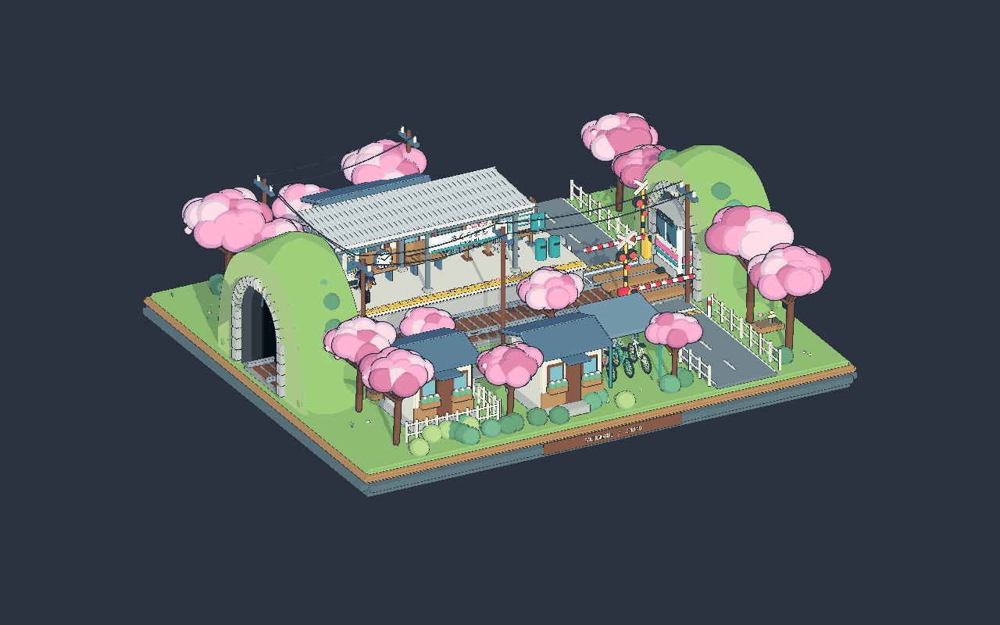
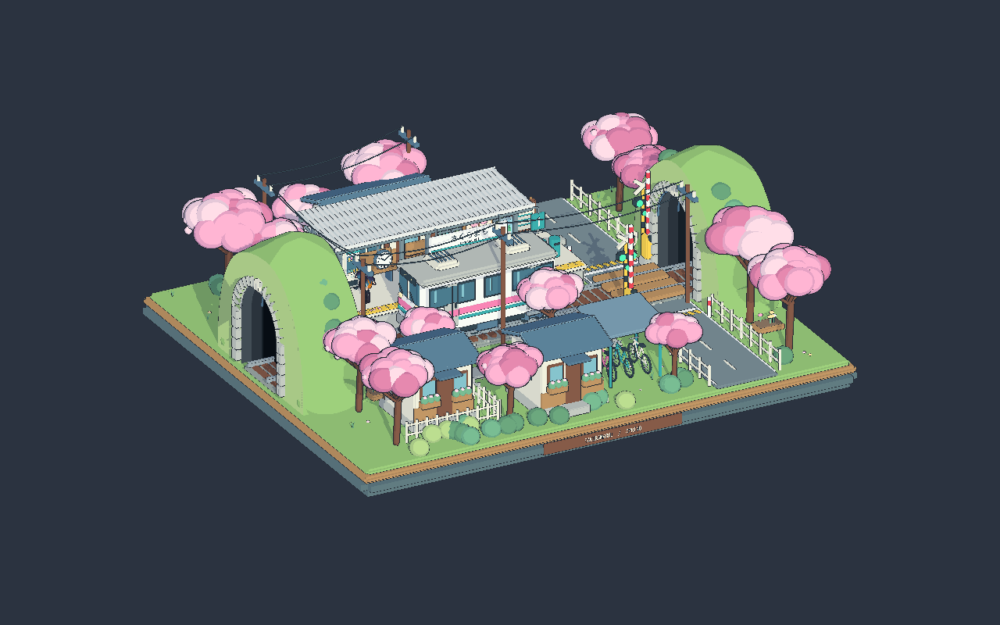

# 从静态模型到循环场景：樱町列车动画入门与修改教程

**适用项目：AIDesktopPetty · Unity 2021.3.21f1c1 · URP 12.1.10 · Timeline 1.6.4**  
**依据：2026-09-15 已交付的代码、场景配置与 Unity 验证记录。**

这份教程解释已经做好的列车动画怎样工作，以及你怎样在它的基础上修改。你不需要先学完 C# 或 Shader。先学会播放和改参数，再逐步理解代码即可。

> 文中的代码有两种：标为“当前代码”的片段来自项目；标为“修改示例”的片段是供你动手练习的方案。修改示例没有自动应用到项目，也不代表项目现在已经采用那些新时间。

## 阅读路线

| 你的目标 | 建议阅读 |
| --- | --- |
| 先看到场景动起来 | 第 1–3 章 |
| 看懂各文件、物体和 Timeline 的关系 | 第 4–6 章 |
| 理解列车、栏杆、灯和隧道的原理 | 第 7–10 章 |
| 添加声音 | 第 11 章 |
| 自己改颜色、停车点、时刻和周期 | 第 12–15 章 |
| 处理故障、迁移场景和验收 | 第 16–18 章 |

## 1. 先看结果：这套动画具体做了什么

这一轮演出长 **180 秒，也就是 3 分钟**。列车先藏在右洞，进入车站、停车、再驶入左洞。两侧灯和栏杆由同一个时间轴驱动。

| 本轮时间 | 列车 | 两侧共六个灯罩 | 两侧栏杆 |
| --- | --- | --- | --- |
| 0–3 秒 | 右洞外侧隐藏 | 绿色与灰色同步闪烁 | 同时开始下降 |
| 3–5 秒 | 隐藏 | 全部红色 | 继续下降 |
| 5–10 秒 | 隐藏 | 全部红色 | 完全落平 |
| 10–30 秒 | 从右黑幕开始出场，逐渐减速 | 全部红色 | 保持落平 |
| 30–33 秒 | 在原摆放位置停稳 | 红色与灰色同步闪烁 | 同时开始抬起 |
| 33–35 秒 | 停站 | 全部绿色 | 继续抬起 |
| 35–45 秒 | 停站 | 全部绿色 | 完全抬起 |
| 45–65 秒 | 从零速逐渐加速，向左离站 | 全部绿色 | 保持抬起 |
| 65–180 秒 | 完全隐藏，已复位到右侧 | 全部绿色 | 保持抬起 |
| 180 秒 | 开始下一轮 | 重新开始预警 | 重新开始下降 |

**停站的 15 秒从“完全停稳”开始计算。** 因此 30–35 秒的抬杆动作包含在 30–45 秒的停站时间内，不是在抬杆完成后再等 15 秒。

**左右六个灯罩统一变色。** 这里没有实现“绿灯亮时两个红灯熄灭”的普通信号灯逻辑；这是你确认的演出效果。停稳后开杆、离站时不再次落杆，也来自已确认的时间表。

### 1.1 实际渲染参考

下面是独立 Unity 验证项目使用同一场景副本渲染的画面。为了方便看清整体，我另外设置了俯视相机；这不是对原场景主相机的修改，也不是 Unity 操作界面截图。



*第 12 秒：列车正在右洞口出场。*



*第 35 秒：列车已停稳，灯恢复绿色，栏杆抬起。*


*第 55 秒：列车已经起步并向左侧行驶。*

## 2. 第一次操作：播放与预览

### 2.1 先认识六个 Unity 名词

| 名词 | 可以怎样理解 | 本项目中的例子 |
| --- | --- | --- |
| Scene，场景 | 保存物体摆放和组件配置的文件 | `3DScene.unity` |
| GameObject，游戏物体 | Hierarchy 中的一项，是组件的容器 | `Train` |
| Component，组件 | 附在物体上的一项功能 | `Transform`、`Playable Director` |
| Transform，变换 | 保存位置、旋转、缩放，也维护父子关系 | 列车的位置、栏杆的旋转 |
| Asset，资源 | Project 窗口中的文件；能被场景引用 | 脚本、材质、音频、Timeline |
| Binding，绑定 | 指定某段逻辑应该控制哪个场景对象 | 把循环轨道绑定到控制器组件 |

另外记住两个窗口：**Hierarchy 显示当前场景的物体；Inspector 显示当前选中物体或资源的属性。** Project 窗口显示磁盘上的项目资源。

### 2.2 在已配置场景中播放

1. 等 Unity 完成导入和编译。如果 Console 有红色编译错误，先处理错误。
2. 在 Project 窗口打开 `Assets/Scenes/3DScene.unity`。如果一直打开的是旧场景状态，重新打开磁盘上的场景；若有未保存的个人修改，先保存为另一份副本。
3. 在 Hierarchy 中展开 `Scene`，找到 `Sakuramachi Scene Loop`。
4. 选中它，Inspector 应出现 `Sakuramachi Scene Loop` 脚本组件和 `Playable Director` 组件。
5. 查看 Director：Playable 应引用生成的 Timeline；`Play On Awake` 已开启，`Wrap Mode` 为 `Loop`。
6. 点击 Unity 顶部的 **Play**。
7. 前 10 秒列车隐藏，这是预警阶段，不是动画失败。可以先观察灯和栏杆。
8. 看列车在第 30 秒停稳、第 45 秒重新起步。停止 Play 后回到编辑状态。

> 初学者最容易漏掉的一点：在 Play 模式中试改的场景组件数值，退出播放时通常会恢复。要永久保留的参数，退出 Play 和 Timeline 预览后再修改，并保存场景。资源文件的修改有不同的保存行为，不能用“退出 Play 一定撤销”来保护所有资源。

### 2.3 不等三分钟，直接检查某个时间点

1. 退出 Play 模式，选中 `Scene/Sakuramachi Scene Loop`。
2. 打开菜单 `Window > Sequencing > Timeline`。
3. 窗口应显示一条场景控制轨道和三条空音效轨道。如果窗口锁定在其他对象，先解除锁定，再选控制器。
4. 开启 Timeline 的预览，拖动播放头到目标位置。播放头就是表示“现在时间”的竖线。
5. 先检查第 5、20、35、55、65 秒。可以放大时间轴，或使用窗口中的时间输入框精确定位。
6. 若时间显示使用帧数或时间码，先核对单位。**180 帧不是 180 秒。** 例如 60 fps 下，180 秒对应 10800 帧。
7. 结束时停止 Timeline 预览；需要修改长期配置时，先退出预览，再保存。

第 35 秒应看到停在站台的列车、绿灯、竖起的栏杆；第 65 秒应看到空站。如果主相机只能看到站台局部，可以在 Scene 窗口观察完整环境。

## 3. 我实际改了哪些东西

本次不是给整个模型录制一个 Blender 动画后重新导出。我利用原模型已经拆好的动态节点，在 Unity 内配置了一个循环控制系统。

### 3.1 文件清单

以下代码和生成资源都在 `Assets/Scripts/Art/Scenes` 中：

| 文件 | 用途 | 初学者是否需要先修改 |
| --- | --- | --- |
| `SakuramachiSceneLoop.cs` | 根据当前时间计算列车、栏杆、灯和行驶声 | 修改时刻或逻辑时需要 |
| `SakuramachiLoopTrack.cs` | 让 Timeline 把当前时间传给控制器 | 通常不需要 |
| `SakuramachiLoopClip.cs` | 定义时间轴上那一段控制片段 | 通常不需要 |
| `SakuramachiTrainTunnel.shader` | 裁掉两个黑幕平面外的车身与描边 | 换渲染方式时才需要 |
| `Editor/SakuramachiLoopSetup.cs` | 自动查找物体、生成资源、建立绑定 | 换模型结构时可能需要 |
| `Editor/SakuramachiLoopValidation.cs` | 在隔离验证项目中执行检查 | 普通使用不需要运行 |
| `Generated/Sakuramachi180.playable` | 保存四条轨道的 Timeline 资源 | 加音频、改总周期时会用 |
| `Generated/Materials/*.mat` | 13 份列车专用材质 | 通常不直接改 |
| `README.md` | 简要使用说明 | 可作速查 |

另外，`Assets/Scenes/3DScene.unity` 增加了控制器、音频对象及绑定，并将列车的 13 个材质槽换成支持隧道裁剪的独立材质。原有其他物体的共享材质没有因此统一替换。

这份详细教程放在 `docs/SakuramachiSceneLoop`，不需要 Unity 将教程插图作为游戏纹理导入。

### 3.2 场景结构

下面是简化结构，省略了一些网格和描边子物体：

```text
Scene
├─ Sakuramachi_Unity
│  ├─ Static_Environment
│  │  ├─ Tunnel_Left → Tunnel_Dark_Left_DepthMask
│  │  └─ Tunnel_Right → Tunnel_Dark_Right_DepthMask
│  └─ Dynamic_Objects                 ← 已禁用的完整模型内动态副本
├─ Train                              ← 实际移动这个独立分件
│  ├─ Train_Visual
│  │  └─ NPR_Outline_Train_Visual
│  └─ Train Movement Audio
├─ CrossingGate_Left
│  ├─ 电机底座
│  └─ GateArm_Left                    ← 左侧铰链
├─ CrossingGate_Right
│  ├─ 电机底座
│  └─ GateArm_Right                   ← 右侧铰链
├─ Signal_Left                        ← 三个灯罩及各自描边
├─ Signal_Right                       ← 三个灯罩及各自描边
└─ Sakuramachi Scene Loop
   ├─ SakuramachiSceneLoop 组件
   ├─ PlayableDirector 组件
   ├─ 警示音 AudioSource 子物体
   ├─ 栏杆音 AudioSource 子物体
   └─ 到站与发车音 AudioSource 子物体
```

**为什么检查重复模型？** 完整 FBX 里也有列车和道闸，场景又使用了独立分件。如果两套都显示，你移动其中一辆，原地仍会留下一辆。实际检查确认完整模型内的 `Dynamic_Objects` 已禁用，所以绑定独立分件即可。

## 4. 为什么采用 Timeline 加脚本

### 4.1 三部分各自负责什么

```text
Timeline 资源：保存轨道、片段和音频编排
             ↓ 被场景中的 Director 播放
PlayableDirector：维护当前时间与循环方式
             ↓ 当前时间传入自定义轨道
SakuramachiLoopMixer.ProcessFrame
             ↓ 调用 Evaluate(当前时间)
SakuramachiSceneLoop：计算本时刻应有的完整场景状态
             ↓
列车位置 / 栏杆旋转 / 灯色 / 隧道裁剪 / 行驶声
```

`ProcessFrame` 可以理解为 Timeline 求值时执行的回调。它不是必须由你手动调用的函数。

### 4.2 这不是普通的“拖关键帧改所有动作”方案

当前实现只有一条统一控制轨道，场景动作由控制器内的时间常量与公式决定。没有为列车和两侧杆子分别创建可编辑的 AnimationClip 曲线。

因此：

- 拖动播放头可以预览。
- 给 Audio Track 添加和移动音频可以调整固定音效。
- **单纯把控制片段从 180 秒拉长到 240 秒，不会自动让列车变慢。**
- **移动控制片段的起点，也不是当前实现支持的动作整体延迟方式。** Mixer 使用的是 Director 总时间，未使用该片段的局部时间来重排动作。

选择这种实现，是为了让本次固定循环的状态一致、便于从任何时间点预览，同时保留 Timeline 的音频编排能力。若以后希望用鼠标拖动每段进站、停车、开杆动作来自由编排，需要进一步拆分自定义轨道或制作独立动画曲线；那属于下一阶段扩展。

### 4.3 一个时钟怎样让多件事保持同步

不要把它想成“列车自己等三分钟，灯自己等三分钟，栏杆再自己等三分钟”。这里所有视觉状态都读取同一个 `director.time`。

当前关键调用：

```csharp
target.Evaluate(director.time,
    info.evaluationType == FrameData.EvaluationType.Playback &&
    info.effectivePlayState == PlayState.Playing && info.effectiveSpeed > 0);
```

第一个参数是时间；第二个参数判断当前是否处于正向播放，让行驶声不会因为单纯拖动预览而启动。

比如 Director 时间为 35 秒，无论你从第 0 秒正常播放到这里，还是直接拖到这里，控制器都能计算出：列车停稳、六灯绿色、栏杆完全抬起。

相比只依赖“到某时刻触发一次”的事件，这种方法更适合拖动预览。不会因为你跳过了第 3 秒的“变红事件”，就导致第 20 秒的灯色不正确。

### 4.4 Loop 与 Unscaled Game Time

配置工具为 Director 设置：

```csharp
director.extrapolationMode = DirectorWrapMode.Loop;
director.timeUpdateMode = DirectorUpdateMode.UnscaledGameTime;
director.playOnAwake = true;
```

分别表示重复播放、采用不受 `Time.timeScale` 影响的游戏时钟、进入运行时自动播放。Unity 官方对这些选项的说明见 [Playable Director 文档](https://docs.unity3d.com/Packages/com.unity.timeline@1.6/manual/play_director.html)。

这里的“不受 timeScale 影响”不等于电脑休眠、程序退出后仍在后台播放。也不等于不能暂停：要暂停本系统，应暂停 `PlayableDirector`。

## 5. 配置工具是怎样把资源接起来的

理解 `SakuramachiLoopSetup`，有助于知道手动拖引用时应该拖哪些对象。

### 步骤 1：寻找当前场景的动态物体

工具遍历场景对象，按名字查找激活的 `Train`、`GateArm_Left`、`GateArm_Right` 和两个黑幕，再收集六个灯罩 Renderer。

其中按名字寻找唯一对象的逻辑使用 `Single`：意味着必须恰好找到一个。找不到或有重名的激活动态副本，都不能继续当成正确场景配置。

灯罩查找要求名字以 `Signal_` 开头并包含 `Lens`，这样 `NPR_Outline_...` 描边不会被当成灯罩改色。

### 步骤 2：记录停车点并测量列车边界

停车点来自列车当前摆放位置。列车边界不是只看 Transform 原点，而是统计网格包围盒，包括描边。

包围盒 `Bounds` 可以理解为“刚好包住整个模型的盒子”。车头、车尾距离原点多远，都能从这个盒子的左右边界得到保守估计。

### 步骤 3：计算出入口位置

车头触及右黑幕时，列车原点还在黑幕后；车尾全部穿过左黑幕时，原点已经越过左黑幕。工具分别按车头和车尾偏移计算原点位置，而不是把原点直接摆在洞口。

### 步骤 4：推导栏杆的向上旋转方向

工具比较局部 Y 旋转到 +90° 和 -90° 时，杆体中心在哪一种情况下更高。这样能根据当前模型的杆体朝向，选择向上的那一侧。

### 步骤 5：生成列车专用材质

复制原列车材质，再把 Shader 换成支持隧道裁剪的版本。复制保留原有配色和 Toon 参数；这些新材质只分配给列车和其描边。

工具要求源材质使用当前的 Sakuramachi Toon Shader，避免把任意其他材质强行转换后丢失外观。

### 步骤 6：建立控制器、Timeline 和绑定

生成控制器物体，为它添加控制脚本和 Director。创建固定长度为 180 秒的 Timeline，创建一段从 0 开始、持续 180 秒的控制 Clip，再把轨道绑定到脚本组件。

这里的绑定不是把 `.cs` 文件拖到轨道。**轨道需要的是场景中已经挂好的组件实例。**

### 步骤 7：建立音频接口并保存配置

创建三条空音效轨道及各自的 AudioSource，同时在列车下创建行驶声 AudioSource。清除列车与杆体的静态标记，使它们适合作为移动对象。

编辑器菜单会保存生成资源并标记场景需要保存；手动使用该菜单后，还要保存场景。工具发现已有控制器时会直接返回，**不会重新测量停车点，也不会覆盖你编辑的音轨**。

> 重复执行配置菜单不是“刷新所有参数”按钮。删除控制器后重跑也不是推荐的重置方法：旧音源、旧 Timeline 和已经替换的材质可能仍在。改参数优先在现有组件上操作。

## 6. 坐标：为什么右洞是负 X，左杆却要正 90 度

### 6.1 世界坐标和局部坐标

- **世界坐标**：相对于整个 Unity 场景。
- **局部坐标**：相对于父物体或指定坐标系。

本系统把 `Scene` 作为 `Railway Frame`，即轨道参考坐标系。三个位置字段保存的都是相对于它的坐标。

```csharp
train.position = railwayFrame.TransformPoint(position);
```

这句先将轨道局部坐标转换为世界坐标，再写给列车。转换会考虑参考物体的位置、旋转和缩放。[TransformPoint 官方说明](https://docs.unity3d.com/2021.3/Documentation/ScriptReference/Transform.TransformPoint.html)

因此，如果整体搬动或旋转 `Scene`，列车路线也一起移动。反过来，如果单独移动环境 FBX、却没有同步修改参考系和端点，路线就可能偏离轨道。

### 6.2 当前场景的实际数值

下列数值经过 Unity 读取，显示时作了四舍五入：

| 项目 | 相对 Railway Frame 的 X | Y | Z |
| --- | ---: | ---: | ---: |
| 右黑幕平面 | -6.12 | — | — |
| 入口列车原点 Entry Position | -8.3205 | 0.74 | 0 |
| 站台列车原点 Station Position | 0.65 | 0.74 | 0 |
| 出口列车原点 Exit Position | 8.2725 | 0.74 | 0 |
| 左黑幕平面 | 6.12 | — | — |

从当前整体观察方向看，列车从画面右边向左边走；在这个导入模型的 Unity 坐标里，却是 X 从小变大。这两种说法并不矛盾。

此外，分件根节点存在 FBX 导入的约 -90° X 旋转与单位换算，实际检查到的 lossyScale 约为 100。不要看到这个数就把根缩放强行改为 1；正确的装配关系已经包含这些导入变换。

### 6.3 为什么左右栏杆不能都用 -90°

两根杆的网格相对于各自铰链向相反方向伸出。在当前导入结构中：

| 铰链 | 抬起 | 落平 |
| --- | --- | --- |
| GateArm_Left | 局部 Y = +90° | 0° |
| GateArm_Right | 局部 Y = -90° | 0° |

这是针对当前模型的实际配置，不是“左杆永远正、右杆永远负”的通用 Unity 规则。如果改变模型朝向或父级旋转，应重新检查视觉结果。

## 7. 列车怎样减速、精确停车、再加速

### 7.1 先把总时间换成本轮时间

当前代码：

```csharp
float t = (float)((seconds % CycleSeconds + CycleSeconds) % CycleSeconds);
```

`%` 是求余数。180 秒周期下，190 秒对应本轮第 10 秒，370 秒也对应本轮第 10 秒。额外加一次周期再求余，是为了让负时间输入也得到非负的本轮时间。

Director 已经会循环，这层取余仍让 `Evaluate` 自身在收到跨周期时间时保持一致，方便验证。

这里不需要把“上一帧的位置”累加到“下一帧的位置”。给定时间后直接算位置，也就不会因帧率不同让停车点逐轮漂移。画面仍然按帧显示，事件会在跨过时间边界的渲染帧体现，不意味着具有无限时间精度。

### 7.2 将一段时间压缩到 0–1

进站从第 10 秒到第 30 秒，代码先计算：

```csharp
float u = (t - RevealTime) / (StopTime - RevealTime);
```

| 实际时间 | 计算 | u |
| --- | --- | ---: |
| 10 秒 | (10−10) / 20 | 0 |
| 15 秒 | (15−10) / 20 | 0.25 |
| 20 秒 | (20−10) / 20 | 0.5 |
| 30 秒 | (30−10) / 20 | 1 |

`u` 不是速度，而是“这一段时间已经过了多少比例”。

### 7.3 Lerp：在两个位置之间取一个位置

可以先把 `Lerp(A, B, w)` 理解为：

```text
结果 = A + (B − A) × w
w = 0：取 A
w = 1：取 B
w = 0.5：取正中间
```

项目使用 `Vector3.LerpUnclamped`。`Unclamped` 表示它不会自动把参数限制在 0–1；本代码通过时间分段确保当前用到的参数在合理范围内。

### 7.4 进站为何越来越慢

当前代码：

```csharp
position = Vector3.LerpUnclamped(
    stationPosition, entryPosition, (1 - u) * (1 - u));
```

这里起点写在第二个参数，是因为权重从 1 降到 0：

- u=0，权重为 1，位置在入口。
- u=0.5，权重只剩 0.25，已经走完 75% 的距离。
- u=1，权重为 0，位置恰好在站台。

同样长的后半段时间只走剩下的 25%，所以视觉上越来越慢。平方曲线在终点的速度为零。

按当前 X 值，第 20 秒位置约为：

```text
0.65 + (−8.3205 − 0.65) × 0.25 = −1.592625
```

### 7.5 停车不是“速度特别小”，而是固定位置

```csharp
else if (t >= StopTime && t < DepartureTime)
    position = stationPosition;
```

第 30 秒到第 45 秒，每次求值都使用同一个站台位置。车辆不会因为一个很小但非零的速度继续滑动。`NormalizedSpeed` 在这段时间保持 0。

### 7.6 发车为何从静止开始加速

```csharp
float u = (t - DepartureTime) / (HiddenTime - DepartureTime);
position = Vector3.LerpUnclamped(stationPosition, exitPosition, u * u);
```

发车权重从 0 按平方增长。经过一半时间时只走了 25% 的距离，后半段走剩下 75%，所以逐渐加速。

第 55 秒，离站已经过去 10 秒，占 20 秒离站时间的一半，列车 X 约为：

```text
0.65 + (8.2725 − 0.65) × 0.25 = 2.555625
```

### 7.7 隐藏与复位为什么不会被看见

```csharp
bool visible = t >= RevealTime && t < HiddenTime;
```

只有第 10–65 秒启用原本可见的列车 Renderer。第 65 秒以后，车体和描边的 Renderer 关闭，然后原点复位到入口位置；下一轮之前始终隐藏。

这里关闭的是 Renderer，不是整个 Train GameObject。这样 Transform 和行驶声接口仍然存在。初始时本来就禁用的 Renderer 也不会被强制开启。

**第 10 秒的定义是车头包围盒触及右黑幕平面。** 具体相机第一次看见车身像素的时刻还会受洞壁遮挡影响；第 65 秒则要求含描边的车尾已经全部越过左黑幕。

## 8. 栏杆怎样在五秒内缓慢转动

### 8.1 只控制铰链，不控制整个道闸

`CrossingGate_Left` 包含底座和杆子。如果旋转整个道闸，电机底座也会跟着翻倒。代码绑定 `GateArm_Left/Right`，其子物体中的杆体与描边会自动跟随。

### 8.2 用一个 0–1 数值代表落杆程度

代码中的 `lowered` 表示：0=完全抬起，1=完全落下。

```csharp
float lowered = t < 5 ? Smooth(t / 5) : t < StopTime ? 1 :
    t < StopTime + 5 ? 1 - Smooth((t - StopTime) / 5) : 0;
```

这段嵌套写法等价于按四个阶段选择数值：

1. 0–5 秒：逐渐从 0 变成 1。
2. 5–30 秒：固定为 1。
3. 30–35 秒：逐渐从 1 变回 0。
4. 35 秒以后：固定为 0。

### 8.3 Smooth 让起止更柔和

```csharp
static float Smooth(float value) => value * value * (3 - 2 * value);
```

这条曲线在开始和结束时变化较慢，中段较快。值依然从 0 走到 1，但不会突然用很大的转速起步或突然停住。

### 8.4 从“落杆程度”得到旋转

```csharp
gate.hinge.localRotation = Quaternion.Slerp(
    Quaternion.Euler(gate.raisedEuler),
    Quaternion.Euler(gate.loweredEuler), lowered);
```

`Quaternion` 是 Unity 用来表示旋转的一种数据类型。初学阶段不必推导四元数：`Euler` 把熟悉的角度转换成旋转，`Slerp` 在两个旋转之间平滑过渡。

`localRotation` 表示相对于父物体的旋转。因此导入后的铰链局部轴，比“场景中看起来是哪一个世界轴”更重要。

## 9. 灯怎样闪烁、变灰、再统一变色

### 9.1 稳定状态和闪烁状态分开计算

当前代码先判断是否处于两个三秒闪烁窗口：

```csharp
bool flashing = t < 3 || (t >= StopTime && t < StopTime + 3);
bool isRed = t >= 3 && t < StopTime + 3;
```

然后决定当前这一小段时间显示灰色还是当前稳定灯色。最后统一写入六个灯罩。

### 9.2 2 Hz 是什么意思

```csharp
bool greyPhase = flashing &&
    (Mathf.FloorToInt(flashTime * Mathf.Max(.1f, flashesPerSecond) * 2) % 2 == 0);
```

默认 `Flashes Per Second=2`，表示每秒两次完整的“灰→有色”循环。

| 闪烁开始后的时间 | 显示 |
| --- | --- |
| 0–0.25 秒 | 灰色 |
| 0.25–0.5 秒 | 当前绿色或红色 |
| 0.5–0.75 秒 | 灰色 |
| 0.75–1 秒 | 当前绿色或红色 |

乘以 2 是为了把一轮闪烁拆成灰色、有色两个半周期。`FloorToInt` 向下取整，`% 2` 判断当前半周期是偶数还是奇数。

进站时在绿/灰之间闪，第 3 秒全部转红；停稳时在红/灰之间闪，第 33 秒全部转绿。

### 9.3 为什么不能只改材质的普通颜色

当前场景使用的 Shader 有自己的 `_AuthoredColor`，用于保存 Blender 来源的线性颜色。当 `_UseAuthoredColor` 开启时，它优先使用这个颜色，而不是普通 `_BaseColor`。

因此脚本同时写入来源色与发光参数。灰色阶段还把发光强度设为 0，否则可能出现“已经变灰却仍在发亮”。

### 9.4 MaterialPropertyBlock 是什么

材质通常会被多个对象共用。如果直接改共享材质，其他使用它的对象也会变色。

`MaterialPropertyBlock` 可以理解为“给这个 Renderer 的这个材质槽附加一份临时参数”。本系统给灯罩单独设置颜色，不改写共享灯材质资源。[SetPropertyBlock 官方说明](https://docs.unity3d.com/2021.3/Documentation/ScriptReference/Renderer.SetPropertyBlock.html)

因此你在播放时点开原始 `.mat` 文件，不一定会看到它的保存颜色改变，这是正常的。真正显示的颜色由 Renderer 上的覆盖参数决定。

这也不是无代价的万能优化：本教程选择它主要为了隔离实例状态和支持恢复，并没有据此声称获得了 GPU 性能提升。

## 10. 列车为什么不会从山后穿出来

### 10.1 黑幕本身的能力有限

原模型的黑幕是一张遮挡视线的平面，不是无限大的空间，也不是物理碰撞墙。列车约 4.32 个轨道参考单位长，隐藏在洞后时可能超出山体覆盖范围。

只依靠这张平面，从某些角度仍可能看见黑幕后伸出的车身。单纯把整车关闭又无法表现“车头先出现、车尾后出现”。

### 10.2 采用两个平面限定允许绘制的范围

在当前轨道坐标中，允许绘制列车的范围是：

```text
右黑幕后隐藏         可绘制车身的范围             左黑幕后隐藏
       x < -6.12  |  -6.12 ≤ x ≤ +6.12  |  x > +6.12
                 右黑幕                 左黑幕
```

列车网格依然完整存在，但在两个平面外的片元不画出来。“片元”可以先理解成正在准备绘制的一个表面采样点。

### 10.3 Shader 中真正执行裁剪的代码

```hlsl
void ClipTunnel(float3 positionWS)
{
    if (_TunnelClip > 0.5)
    {
        clip(dot(_TunnelPlaneMin, float4(positionWS, 1)));
        clip(dot(_TunnelPlaneMax, float4(positionWS, 1)));
    }
}
```

`dot` 计算点相对于平面的带符号结果；`clip` 在结果为负时放弃绘制。两个条件共同决定这个点是否处于可见区间内。

初学者不必手动填写四维平面参数。C# 代码从 `railwayFrame.worldToLocalMatrix` 取出对应 X 坐标的那一行，生成 `_TunnelPlaneMin/Max`。所以整体移动、旋转参考系时，裁剪平面也能跟随。

### 10.4 车身、描边、阴影都要处理

Shader 在以下三个 Pass 中调用同一个裁剪函数：

| Pass | 负责什么 | 不裁剪可能出现的问题 |
| --- | --- | --- |
| ToonForward | 可见颜色 | 山后出现车身 |
| ShadowCaster | 投射阴影 | 车已经不可见，影子还泄露位置 |
| DepthOnly | 深度信息 | 隐藏表面仍可能影响依赖深度的效果 |

描边是独立网格，使用同样的裁剪材质，因此不会留下一圈漂浮黑线。模型源 Shader 的三档 Toon 外观被保留，没有为了裁剪去修改整个场景的材质。

**限制：** 当前方案假定两个黑幕平面垂直于 Railway Frame 的 X 轴。随意倾斜单个洞口、换弯轨、让列车转弯，都需要扩展当前逻辑。Shader 裁剪只改变渲染，不会自动裁切碰撞体或更改物理模拟。

## 11. 一步一步添加音频

### 11.1 先区分 AudioClip 和 AudioSource

- **AudioClip** 是声音素材，例如导入 Unity 的 WAV 文件。
- **AudioSource** 是场景中的播放组件，相当于扬声器。
- **Audio Track** 决定在时间轴的什么位置播放哪些素材，并绑定到一个 AudioSource。

当前有四个音频接口：三条固定音效轨道，各用一个 AudioSource；还有列车上的一个行驶声 AudioSource。

### 11.2 给进站预警加声音

1. 准备一段警示音，将文件拖进 Project 窗口中的素材目录，等 Unity 导入完成。
2. 选中 `Scene/Sakuramachi Scene Loop`，打开 Timeline。
3. 找到名为 `警示音（0–3 / 30–33秒）` 的 Audio Track。
4. 将导入的 AudioClip 从 Project 拖到这条轨道上。
5. 选中音频片段，将开始时间设为 0 秒。让它在 3 秒前结束，可选用三秒素材或裁短较长素材。
6. 再放入一次同样的素材，开始时间设为 30 秒、结束在 33 秒。
7. 播放第 0–5 秒和第 30–35 秒，检查声音与闪灯同步。
8. 调整音量；如素材切断时有突兀感，使用音频片段的淡入淡出控制，或先在音频软件中处理。

素材短于目标长度时，不要以为把片段边缘拉长就一定会自动补出足够声音。可以准备合适时长的素材，或明确配置循环/重复片段，再试听确认。

### 11.3 给栏杆与到站发车加声音

操作方法相同，只是使用不同轨道和开始时间：

| 轨道 | 建议开始时间 | 注意 |
| --- | --- | --- |
| 栏杆音 | 0 秒、30 秒 | 杆体各运动五秒，机械声可匹配这段长度 |
| 到站与发车音 | 到站 30 秒、发车 45 秒 | 刹车声可以放在停稳前，例如 27 秒；依据素材听感微调 |

轨道名字只是帮助阅读的文字，不是自动触发规则。把“45秒”重命名成“50秒”，声音不会自动移动。真正要修改的是片段的开始时间。

### 11.4 添加随速度变化的行驶声

1. 准备一段首尾衔接自然的列车运行循环音。
2. 退出 Play，选中控制器物体。
3. 在 `Sakuramachi Scene Loop` 组件找到 `Movement Loop`，拖入这段 AudioClip。
4. `Movement Audio` 应已引用 `Train/Train Movement Audio` 上的 AudioSource；通常不需要改。
5. 先把 `Movement Volume` 设为较低数值，例如 0.3。
6. `Movement Pitch` 的 X/Y 分别是低速和高速的音调值，默认 0.7 与 1.15。
7. 进入 Play，听列车减速时声音变弱、变低，停车时停止，离站时增强。

当前脚本中的对应逻辑是：

```csharp
movementAudio.volume = movementVolume * Mathf.Sqrt(NormalizedSpeed);
movementAudio.pitch = Mathf.Lerp(movementPitch.x, movementPitch.y, NormalizedSpeed);
```

`NormalizedSpeed` 是相对于本轮进出站最大速度的比例，通常在 0–1 内。音量使用平方根，使低速段也保留一定可听度；音调在两个配置值之间变化。

脚本在需要时启动循环播放，停稳、隐藏、暂停或没有素材时停止。**不要让 Timeline 音频轨道同时控制这个行驶 AudioSource**，否则两个系统会争抢播放状态。

### 11.5 没声音时按这个顺序排查

1. 音频资源是否已导入，片段是否放在当前时间能经过的位置？
2. 音轨是否绑定了 AudioSource，是否被静音？
3. 行驶声是不是只填了 AudioSource 的 Clip，却没填控制器的 `Movement Loop`？脚本使用的是后者。
4. 是否只在编辑器拖动时间轴？脚本行驶声只在运行时正向播放时启动，拖动预览不会启动它。
5. 场景是否有启用的 AudioListener，通常位于主相机？
6. 音量是否过小，Unity Game 窗口音频是否静音，系统音量是否正常？
7. 行驶声 AudioSource 默认采用 3D 空间音频；相机/Listener 距离远会听不清。先把该 AudioSource 的 Spatial Blend 临时改为 0，判断是否是距离衰减造成，再决定最终需要 2D 还是 3D 声音。

本次没有提供真实音频素材，所以已经验证的是空接口不阻碍动画及暂停时停止行驶声，尚未对实际音频的音量、音调和循环接缝做听感验收。

## 12. Inspector 参数速查与不改代码的练习

### 12.1 参数分别代表什么

以下是控制器组件的主要字段。Inspector 通常会把 `stationPosition` 显示成 `Station Position`，其他字段类似。

| 字段 | 含义 | 修改注意 |
| --- | --- | --- |
| Railway Frame | 路径使用的参考坐标系 | 当前是 Scene，不能随便换成 Train |
| Train | 要移动的列车根 Transform | 应拖独立列车根，不是仅一个网格 |
| Station Position | 停车点，相对参考系 | 只调 X 可沿当前直轨移动停车点 |
| Entry Position | 车头刚触及右黑幕时的列车原点 | 不是黑幕自身坐标 |
| Exit Position | 车尾完全过左黑幕后的位置 | 包含描边和少量余量 |
| Tunnel Min X / Max X | 允许绘制的局部 X 范围 | 当前约 -6.12 / 6.12 |
| Gates → Hinge | 每侧的铰链 Transform | 不要拖整个电机底座 |
| Gates → Raised Euler | 抬起姿态 | 当前左 +90、右 -90，角度位于 Y |
| Gates → Lowered Euler | 落下姿态 | 当前都为 0 |
| Lenses | 六个灯罩 Renderer | 不包含描边 |
| Green / Red / Grey | 三种线性颜色 | 是 Vector4，X/Y/Z/W 对应 R/G/B/A |
| Flashes Per Second | 每秒完整闪烁次数 | 默认 2，不是每次闪烁持续秒数 |
| Green / Red Emission | 有色阶段的发光强度 | 灰色阶段固定为 0 |
| Movement Audio / Loop | 行驶声源与素材 | 留空素材可正常运行动画 |
| Movement Volume / Pitch | 行驶声音量与低/高速音调 | 实际效果需要试听 |

`CycleSeconds` 等时间是 `const` 常量，**没有显示成 Inspector 可编辑字段**。这是当前实现的实际边界。

### 12.2 练习 A：闪得更慢

1. 退出 Play 和 Timeline 预览。
2. 把 `Flashes Per Second` 从 2 改为 1。
3. 保存场景，再播放预警阶段。
4. 预期：三秒内完成三轮灰/有色循环，但第 3 秒仍准时转红，栏杆仍在第 5 秒落平。

这个练习只改变闪烁频率，不改变闪烁窗口长度。

### 12.3 练习 B：让灰色更亮

1. 将 `Grey` 的 X、Y、Z 从 0.12 改为 0.2，W 保持 1。
2. 不要改为 255；这里通常使用 0–1 的颜色分量。
3. 预览第 0 秒或第 30 秒，检查灰色阶段。
4. 预期：灰色变亮，但没有发光。

这些值按线性颜色使用，不能直接把截图中的 RGB 数字除以 255 后就断言外观完全相同。初学时先小幅修改并在实际场景中比较。

### 12.4 练习 C：停车点向左移动半个单位

当前画面向左对应参考系正 X。把 `Station Position.x` 从约 0.65 改为 1.15，Y/Z 保持不变。

修改后预览 30 秒和 45 秒，列车应停在新位置。Entry/Exit 不变时，进站与离站的距离会改变；各段时间仍为 20 秒，所以速度也会随距离改变。

**不要只在 Hierarchy 拖动 Train 然后认为停车点已经更新。** 播放时脚本仍以 `Station Position` 为准。若你用拖动来寻找新停车点，需要把相对 Railway Frame 的位置填回该字段。

当前 Train 的直接父物体就是 Railway Frame，所以它在 Inspector 的 Local Position 可以作为填写参考。如果将来改变父子结构，这两组局部坐标不一定相同。

### 12.5 练习 D：栏杆不用完全竖直

将左杆 Raised Euler 的 Y 从 90 改为 80，右杆从 -90 改为 -80，其他角度不动。预览 35 秒，应看到两根杆都停在略微倾斜的位置。

修改的是抬起终点姿态，不是抬杆时长。要改时长，见下一章。

## 13. 修改时间：先明确哪些数必须一起改

### 13.1 当前时间定义在哪里

打开 `Assets/Scripts/Art/Scenes/SakuramachiSceneLoop.cs`，找到顶部：

```csharp
public const double CycleSeconds = 180;
public const float RevealTime = 10, StopTime = 30, DepartureTime = 45, HiddenTime = 65;
```

| 常量 | 含义 |
| --- | --- |
| CycleSeconds | 整轮周期 |
| RevealTime | 车头触及右侧黑幕的时刻 |
| StopTime | 完全停稳的时刻，也是恢复灯杆的开始 |
| DepartureTime | 停站结束、重新移动的时刻 |
| HiddenTime | 车尾完全通过左幕、整车隐藏的时刻 |

时间顺序应满足：

```text
0 < RevealTime < StopTime < DepartureTime < HiddenTime < CycleSeconds
停站时长 = DepartureTime − StopTime
```

预警目前固定从第 0 秒开始。因此保持“出洞前十秒预警”，就应让 RevealTime 保持为 10。只把它改成 20，会变成提前二十秒预警；不是把整个预警流程一起后移。

### 13.2 改进站/离站时长前，先消除声音计算里的固定 10

这是当前代码中需要特别解释的一处：

```csharp
float arrivalSpeed = Mathf.Abs(entryPosition.x - stationPosition.x) / 10f;
float departureSpeed = Mathf.Abs(stationPosition.x - exitPosition.x) / 10f;
```

为什么是除以 10？现在每段运动都是 20 秒，平方曲线的最大速度是 `2 × 距离 / 时长`，也就是 `距离 / 10`。

**这个 10 是“20 秒运动时长的一半”，不是提前十秒预警。** 改运动时间后，位移公式会使用新时长，但这两行若不修改，声音速度比例可能与真实运动不一致。

下面是供修改使用的替换代码。用它替换上面两行，后面的 `float maxSpeed = ...` 保留：

```csharp
float arrivalDuration = StopTime - RevealTime;
float departureDuration = HiddenTime - DepartureTime;

float arrivalSpeed = 2f * Mathf.Abs(entryPosition.x - stationPosition.x)
    / arrivalDuration;
float departureSpeed = 2f * Mathf.Abs(stationPosition.x - exitPosition.x)
    / departureDuration;
```

这要求两个时长都大于 0，所以先检查时间顺序。默认 20 秒时，新写法与原来的除以 10 等价。

> 这段通用化写法是教程提供的修改方案，尚未代替项目原有代码。你准备实际改运动时长时，再一起应用。不要只修改一半。

### 13.3 练习 E：停车从 15 秒改成 25 秒

保持进站 20 秒、离站 20 秒、总周期 180 秒，则：

```csharp
public const float RevealTime = 10, StopTime = 30, DepartureTime = 55, HiddenTime = 75;
```

逐步操作：

1. 在代码中只替换上述一行，保存并等待 Unity 编译。
2. 预览 30–55 秒，检查列车在新停站区间一直固定。
3. 预览 55 秒开始起步、75 秒已经隐藏。
4. 如果有发车音效，把原第 45 秒的音频移到第 55 秒。
5. 灯和栏杆仍在第 30 秒开始恢复，不需要移动；空站等待改为 75–180 秒。
6. 更新控制片段和音轨的说明名称，以免名字里还写着旧的 45/65 秒。

这个例子里两段运动仍各 20 秒，所以旧速度公式数值仍成立；为了后续更方便修改，也可以先采用上一节的通用写法。

### 13.4 练习 F：进站、离站都改成 40 秒

采用下面这组时间：

```csharp
public const float RevealTime = 10, StopTime = 50, DepartureTime = 65, HiddenTime = 105;
```

同时完成以下操作：

1. 按 13.2 节替换两行速度计算。
2. 保存编译。新时序为 10–50 秒进站，50–65 秒停车，65–105 秒离站。
3. 原来放在 30 秒的恢复警示音、抬杆音改放在 50 秒。
4. 发车音改放在 65 秒。到站前刹车声也相应后移。
5. Timeline 仍保持 180 秒；105–180 秒为空站等待。
6. 检查 50 秒速度为零、停车点准确，65 秒开始起步。不要只检查某一帧“看起来位置差不多”。

同样距离用两倍时间完成，这种平方曲线的最大速度也会降为一半。

### 13.5 练习 G：把一轮改成 240 秒

如果只想增加空站等待，不改变进站、停车和离站时刻，应同步改三个地方：

1. **脚本周期**：把 `CycleSeconds = 180` 改成 `240`。
2. **Timeline 资源总长度**：在 Project 选中 `Generated/Sakuramachi180.playable`，Inspector 的 `Duration Mode` 保持 `Fixed Length`，把 `Duration` 改为 240 秒。
3. **控制 Clip 长度**：选中时间轴上的统一控制片段，保持开始时间为 0，把片段持续时间改为 240 秒。注意时间输入单位。

Director 的 Wrap Mode 仍为 Loop。音效位置不变，最后一次离站仍在 65 秒完成，空站等待持续到 240 秒。

为什么要三处一起改？脚本负责“怎样解释当前时间”，Timeline 资源负责“播放到何时回到开头”，Clip 保存自己的覆盖长度。仅修改脚本常量不会自动重写磁盘中已经保存的资源与片段长度。

设置工具和 Clip 的默认 duration 会用于新建资源，但**已有资源不会因为默认值改了就自动更新**。重复运行 Setup 菜单也不会刷新已有控制器。文件名仍叫 `Sakuramachi180` 不影响运行，不过建议在 Unity Project 窗口中重命名成清楚的名字；通过 Unity 移动/重命名以保留 `.meta` 引用关系。

### 13.6 练习 H：栏杆时长改成 8 秒，闪灯仍为 3 秒

先在时间常量附近新增：

```csharp
public const float GateMoveSeconds = 8f;
```

然后找到原来的 `float lowered = ...`，把整个定义替换为：

```csharp
float lowered;
if (t < GateMoveSeconds)
{
    lowered = Smooth(t / GateMoveSeconds);
}
else if (t < StopTime)
{
    lowered = 1f;
}
else if (t < StopTime + GateMoveSeconds)
{
    lowered = 1f - Smooth((t - StopTime) / GateMoveSeconds);
}
else
{
    lowered = 0f;
}
```

下方写入 `Quaternion.Slerp` 的代码保持原样。默认时序下，落杆第 8 秒完成，仍早于第 10 秒出洞；抬杆第 38 秒完成，仍处于停车期间。

如果有栏杆声音，也要调整到八秒动作长度。不要全文件搜索“5”后统一替换，因为其他数字可能表达不同含义。

### 13.7 练习 I：闪灯持续 4 秒

增加：

```csharp
public const float FlashSeconds = 4f;
```

然后将下面四个变量的原定义替换为这组定义：

```csharp
bool flashing = t < FlashSeconds
    || (t >= StopTime && t < StopTime + FlashSeconds);
float flashTime = t < FlashSeconds ? t : t - StopTime;
bool greyPhase = flashing
    && (Mathf.FloorToInt(flashTime * Mathf.Max(.1f, flashesPerSecond) * 2) % 2 == 0);
bool isRed = t >= FlashSeconds && t < StopTime + FlashSeconds;
```

这次改变的是闪烁窗口，频率仍由 `Flashes Per Second` 决定。默认时间下第 4 秒转红、第 34 秒转绿；栏杆依然五秒完成。

改变闪灯或栏杆时长后，要保持它们在进站前完成，并按你想要的顺序安排恢复过程。不要把恢复时长设置得超过停站时间，却仍期待列车等杆完全抬起后才离站——当前发车仍由 DepartureTime 单独决定。

## 14. 移动黑幕、改变列车尺寸时怎样重新校准

仅修改停车点通常比较简单；修改列车长度和隧道位置会牵涉出入口与裁剪边界。

### 14.1 先认识前后偏移

当前列车朝参考系正 X 运动。配置时包含描边的边界约为：

```text
车头相对列车原点偏移 ≈ +2.2005
车尾相对列车原点偏移 ≈ −2.1225
```

不是精确对称，是因为网格形状与描边边界并不以根原点完全对称。

于是入口原点是：

```text
入口原点 = 右黑幕 X − 车头偏移
         = −6.12 − 2.2005
         ≈ −8.3205
```

出口原点是：

```text
出口原点 = 左黑幕 X − 车尾偏移 + 0.03余量
         = 6.12 − (−2.1225) + 0.03
         ≈ 8.2725
```

这说明为什么不能把 Entry Position 直接填成 -6.12：那会使车头已经越过黑幕约 2.2 个单位，启用 Renderer 时可能出现突兀跳出。

### 14.2 操作流程

1. 先复制一份场景作练习，退出 Play 和预览。
2. 调整列车或黑幕，确定轨道方向仍平行 Railway Frame 的 X 轴。
3. 修改 `Tunnel Min X / Max X` 为新黑幕平面的局部 X 值。黑幕 Transform 原点未必就在平面中心，不要只抄 Transform Position。
4. 重新确定车头、车尾相对于列车根的偏移。包含描边，避免黑线最后才消失。
5. 按上面的公式填写 Entry/Exit Position；Y/Z 与轨道上的停车高度和横向位置保持一致。
6. 预览第 10 秒附近，确保车头从幕内逐渐出现。
7. 预览第 64–65 秒附近，确保车尾完全过幕后才整体关闭；如果接近消失时突跳，优先查出口位置与包围盒。
8. 从正面、背面、侧面观察，并检查阴影。

配置工具的 `BoundsInFrame` 展示了怎样用代码测量：逐个取得 MeshFilter 的 mesh.bounds，将盒子的八个角转换到统一参考系，再合并成总包围盒。盒子法可能比精确网格略保守，但适合确保车尾和描边完全隐藏。

**当前菜单不会自动刷新这组测量值。** 如果频繁换模型，更合适的后续扩展是增加“重新校准路径”的独立按钮，保留已有 Timeline 和音频绑定。当前未实现这个按钮。

## 15. 看懂代码中的保存、恢复和常用语法

### 15.1 为什么播放前要保存原状态

预览会临时改位置、颜色与 Renderer 开关。如果停止后不恢复，你的编辑器场景可能留在半抬杆、灰灯、隐藏列车的状态。

`CaptureOriginalState()` 首次求值时记录：

- 列车原本的 localPosition。
- 每个列车 Renderer 原本是否启用。
- 两根杆的原始 localRotation。
- 灯罩与列车各材质槽原本的 MaterialPropertyBlock。

`captured` 是布尔值，防止每一帧把动画中间状态重新当成“原始状态”。

`RestoreOriginalState()` 恢复这些记录，停止行驶声并清空临时缓存。它可以重复调用；缓存已经恢复后，再调用不会重新覆盖一遍动画状态。

### 15.2 Pause 与 Stop 不同

| 操作 | 当前系统的预期 |
| --- | --- |
| Director.Pause() | 停在当前姿态，停止脚本行驶声 |
| Director.Stop() | 结束播放并恢复原始场景姿态 |
| 销毁 Timeline Graph | 恢复原始状态 |
| 禁用/销毁控制组件 | 恢复已缓存状态并停止行驶声 |

运行时测试发现，仅依赖 Graph 销毁回调，Stop 的恢复可能有延迟。因此组件订阅了 `PlayableDirector.stopped`，在停止时主动恢复。

但**不要把只取消勾选控制脚本当成整个 Timeline 的暂停按钮**：Director 是另一个组件，三条固定音频轨道由它管理。需要整体暂停时使用 Director.Pause，或正常停止播放。

### 15.3 初学者语法速查

| 代码形式 | 含义 |
| --- | --- |
| `public Transform train;` | 保存一个可引用的 Transform；这类可序列化字段可显示在 Inspector |
| `const float StopTime = 30;` | 编译时常量，不是可在 Inspector 拖动的数值 |
| `Vector3` | 三个数，常用于 X/Y/Z 位置 |
| `Vector4` | 四个数；本项目用作线性 R/G/B/A 颜色或平面参数 |
| `bool` | 只有 true/false 两种值 |
| `if / else` | 根据条件选择执行路径 |
| `foreach` | 对一组对象逐个执行相同操作，例如六个灯罩 |
| `condition ? a : b` | 条件成立取 a，否则取 b |
| `=>` | 简写的方法体或表达式，例如 Smooth 函数 |
| `[Header(...)]` | 在 Inspector 增加分组标题，不改变动画逻辑 |
| `GetComponent<T>()` | 从当前物体取得一个指定类型组件 |
| `GetComponentsInChildren<T>()` | 搜索当前物体及其子物体中的组件 |
| `null` | 当前没有有效对象引用 |

已有场景字段会被 Unity 序列化保存。修改 `.cs` 中字段的默认值，通常不会覆盖已经保存在场景里的那个字段值。例如把代码里的默认 `flashesPerSecond` 改成 1，已有控制器仍可能保持 Inspector 中保存的 2；应在该组件上直接改值。

## 16. 常见故障与定位顺序

| 现象 | 优先检查 | 处理方向 |
| --- | --- | --- |
| 前几秒看不到车 | 是否在 0–10 秒 | 这是预警阶段；看灯和栏杆是否动作 |
| 所有东西都不动 | Console、Director 的 Playable/Play On Awake、轨道绑定 | 先解决编译错误，再确认绑定对象存在 |
| 车原地留了一辆 | 完整模型的 Dynamic_Objects 是否被开启 | 保持动态副本禁用，只使用独立分件 |
| 灯颜色没变 | 六个 Lenses 引用、材质 Shader、是否仅看原 .mat | 确认绑定灯罩 Renderer；不是描边 |
| 灰色仍然发亮 | 是否改过发光代码或另有控制脚本 | 灰色阶段 emission 应为 0 |
| 栏杆向下穿地 | Raised Euler 的 Y 符号 | 当前左 +90、右 -90；不要照搬同一符号 |
| 底座也旋转 | Hinge 是否误填 CrossingGate 根物体 | 填 GateArm 铰链 |
| 列车离轨 | Railway Frame、三个位置的 Y/Z、父级变换 | 用同一参考系校准，不混用世界坐标 |
| 洞后伸出车身 | 列车是否使用专用裁剪材质、裁剪范围是否正确 | 车体和描边的材质都要检查 |
| 车身没了但描边还在 | 描边材质或 Renderer 没被覆盖 | 保持描边在 Train 子层级，并使用裁剪 Shader |
| 列车突然跳出/突然消失 | Entry/Exit 是否用了车头/车尾偏移 | 不要把原点直接放到黑幕上 |
| 改了周期还是三分钟 | Timeline 资源固定长度和控制 Clip 长度 | 按 13.5 节同步三处 |
| 把片段拉长但车速没变 | 当前是自定义统一控制轨道 | 改运动时间常量，并校正速度公式 |
| 移动 Train 后播放又回旧停车点 | Station Position 还是旧值 | 在控制器中更新停车点 |
| 重跑菜单没有更新位置 | 已有控制器会直接返回 | 这是避免覆盖配置的行为，手动更新参数 |
| 新场景配置时报唯一对象错误 | 动态节点改名、缺失或重名 | 工具按激活物体名字匹配，需要相应修改查找逻辑 |
| 停止后仍像在预览 | Timeline 预览仍开启或其他脚本在写状态 | 先关闭预览，避免多个系统控制同一属性 |

控制器有 `ValidateBindings(out string error)` 方法，但当前 `Evaluate` 对无效绑定会直接返回，并不会把该错误自动打印到 Console。所以“没有报错”不能代替检查 Inspector 中的空引用。配置菜单自己的异常会输出日志。

需要临时排查绑定时，可在熟悉代码后给 `CaptureOriginalState()` 的验证失败分支加日志；不要直接在每帧无限打印，避免 Console 被同一错误刷满。

## 17. 复制场景、保存与恢复

### 17.1 做练习前，区分场景副本与资源副本

复制 `.unity` 场景适合备份物体摆放和组件参数，但副本仍可能引用同一个 Timeline 和同一组材质。

- 只在练习场景修改控制器字段：通常只影响这份场景。
- 修改共享 Timeline 的音频片段或总长度：引用同一 Timeline 的其他场景也会看到变化。
- 修改 C# 常量：使用同一脚本的所有场景都会采用新逻辑。

如果要独立练习音轨，先在 Unity Project 中复制 `.playable` 资源，再将练习场景的 Director 指向新资源。**复制 Timeline 后需要检查或重新指定轨道绑定**，因为 Director 的绑定是按轨道对象对应的，新资源中的轨道不是原轨道对象。

最省心的学习顺序是先只练习 Inspector 参数，再练习复制 Timeline，最后练习改代码。使用 Git 时，可以在开始一组练习前记录一次明确的版本。

### 17.2 在相同结构的新场景自动配置

适用于尚未配置这套控制器、使用原 Sakuramachi Toon 材质的同结构场景：

1. 检查独立 Train、两根 GateArm、六个灯罩和两张黑幕存在且名称匹配。
2. 将列车摆到你希望的停车位置。
3. 关闭完整模型内重复的 Dynamic_Objects。
4. 执行 `Tools > Sakuramachi > Set Up 180 Second Scene Loop`。
5. 检查生成的引用与端点，保存场景。
6. 在 Timeline 预览关键时刻，再进入 Play 检查循环。

当前工具不是通用铁路动画系统。只改对象名字、不改配置代码，或直接用于另一套 Shader/另一种轨道结构，都不能保证正确工作。

### 17.3 .meta 文件为什么要一起保留

Unity 用 `.meta` 文件中的 GUID 识别资源。场景和 Timeline 通过这些标识引用脚本、材质等，而不是只依赖文件名。

在 Unity Project 窗口中移动或重命名资源，一般能保持引用。把 `.cs`、`.mat` 或 `.playable` 单独复制到别的项目时漏掉 `.meta`，就可能使已有场景的引用失效。

配置工具支持场景对象与组件的 Undo，但生成到磁盘的 Timeline/材质资源不应被假定一定随一次 Ctrl+Z 全部清理。恢复前先区分要还原的是场景配置，还是已经创建的资源文件。

## 18. 每次修改后怎样验收

### 18.1 初学者可手动执行的检查表

- 预警与落杆是否同时开始？闪灯结束时是否全部变红？
- 列车出现前栏杆是否已经完成下降？
- 列车是否沿轨道移动，接近站台时逐渐减速？
- 完全停稳的位置是否与设定停车点一致？
- 停站时长是否等于 `DepartureTime − StopTime`？
- 停站期间有没有细小滑动，灯和栏杆是否按新时刻恢复？
- 离站是否从静止开始，六灯是否仍统一变色？
- 入洞时车尾、描边和影子是否都隐藏，没有一闪而过的复位？
- 第二轮是否与第一轮一样，所有音效是否每轮都出现在正确时刻？
- 暂停后是否保持姿态，停止或退出预览后是否恢复编辑状态？

建议先拖动检查关键时刻，再至少看两轮播放。拖动预览适合检查状态，连续播放适合检查速度感、声音接缝和循环边界。

### 18.2 本次已经完成的验证

在隔离 Unity 项目中进行了：

1. 实际读取层级、网格边界、材质与铰链方向。
2. 检查 Timeline 配置及六灯、双杆引用。
3. 对两个周期的多个对应时刻求值，比较位置、旋转与颜色是否一致。
4. 检查 30–45 秒停车无漂移，速度为零。
5. 检查 10 秒车头触及黑幕、65 秒之前含描边车尾已全部通过出口。
6. 检查共享灯材质未被改写、预览状态能够恢复。
7. 使用 D3D11 渲染 11 个关键时间点，检查 Shader 支持情况和编译错误。
8. 实际进入 Play Mode，以 30 倍速度完成两轮 180 秒循环；将 timeScale 设为 0 后仍按不缩放时钟推进。
9. 检查暂停保持姿态，Stop 恢复原场景状态，并修复测试中发现的停止恢复延迟。

验证记录位于项目 `.ai` 目录：`scene-loop-inspection.txt`、`scene-loop-validation.txt`、`scene-loop-playback.txt`；`.ai` 是本机工作记录目录，不作为教程离线插图的依赖。

这些检查不等于已经对所有相机角度、所有替换模型、所有声音素材或最终桌宠玩家构建完成验证。你修改参数或代码后，需要针对变化重新检查。验证脚本里包含本次 30/45/65 等时间的断言，**修改时间表后不能期待旧断言仍直接通过**；应同步调整验证预期。

### 18.3 建议的三个学习小任务

**任务一：只改表现。** 闪烁改为 1 Hz、灰色改亮，证明时间表没变。完成后你就掌握了 Inspector 字段与运行状态的关系。

**任务二：只改停站。** 将停车改为 25 秒，同时后移发车音。完成后你就理解了“到达时刻、停站时长、离开时刻”的区别。

**任务三：改整个节奏。** 按第 13.4 节把进出站都改成 40 秒，采用通用速度公式，并检查两轮。完成后再尝试将总周期改成 240 秒。

## 结语：记住这五句话就能开始维护

1. **Director 提供时间，控制脚本根据时间计算状态。**
2. **改显示参数找 Inspector，改动作时刻找常量，改固定音效找 Timeline 音频片段。**
3. **列车原点不等于车头或车尾，出入口要结合 Bounds 计算。**
4. **当前模型的局部轴决定旋转方向，不能只凭“左右”猜正负角度。**
5. **改周期要同步脚本、Timeline 资源、控制片段；改运动时长要同步声音速度计算。**

## 官方资料与项目依据

- [Unity Timeline 1.6：Playable Director](https://docs.unity3d.com/Packages/com.unity.timeline@1.6/manual/play_director.html)：播放时钟、Loop 和绑定。
- [Unity 2021.3：Transform.TransformPoint](https://docs.unity3d.com/2021.3/Documentation/ScriptReference/Transform.TransformPoint.html)：局部坐标转换为世界坐标。
- [Unity 2021.3：Renderer.SetPropertyBlock](https://docs.unity3d.com/2021.3/Documentation/ScriptReference/Renderer.SetPropertyBlock.html)：Renderer 参数覆盖。
- 项目实际源码：`Assets/Scripts/Art/Scenes`。本教程对动作、字段、默认值和限制的说明以这里的交付代码为依据。
- 本地 Timeline 包源码：`Library/PackageCache/com.unity.timeline@1.6.4`。其中 Inspector 代码用于核对资源的 Duration Mode / Duration 等属性名称。

本教程未自动应用任何练习中的修改。当前项目仍保留你确认的 180 秒循环、20 秒进站、15 秒停站、20 秒离站配置。
